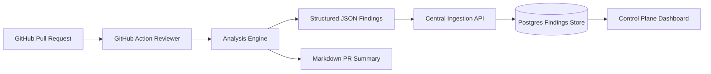

# Target Architecture

The system is reviewer-first and control-plane-ready.

## Core Components

### 1. GitHub Action Reviewer
- Runs on pull request events.
- Collects changed files and metadata.
- Produces markdown feedback and structured findings artifacts.

### 2. Analysis Engine
- Applies deterministic security checks to narrow candidates.
- Uses LLM reasoning to explain likely risk, reduce noise, and shape findings.
- Emits findings as structured JSON.

### 3. Central Ingestion API
- Accepts reviewer outputs from repositories.
- Validates schema compatibility and persists findings.

### 4. Findings Store
- Stores findings, runs, repositories, and summary metadata for later analysis.

### 5. Control Plane Dashboard
- Provides security-team visibility into adoption, findings, trends, and coverage.
- Stays thin until reviewer data and ingestion are proven.

## Mermaid Diagram

## Architectural Notes

- Reviewer output is the contract; downstream systems consume it.
- Deterministic checks should bound the reasoning problem.
- The dashboard depends on stored reviewer outputs, not direct reviewer coupling.
