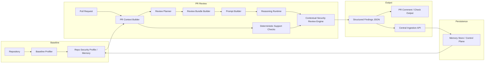

# parity-zero Architecture Context

## Summary

parity-zero is designed as a **repository-aware, reviewer-first** system that
reasons about pull request changes in the context of a repository security
baseline and persistent review memory.

The architecture reflects the corrected product direction: contextual security
review is the primary value, with deterministic checks as a supporting signal
layer.  A thin backend and later dashboard are built around the structured
findings contract.

---

## High-level components

### 1. GitHub Action Reviewer
Runs on pull request events and coordinates the review workflow.

Responsibilities:
- gather changed files and metadata
- invoke baseline profiling (or load existing baseline)
- build PR review context combining delta, baseline, and memory
- invoke the contextual review engine
- produce markdown review output
- emit structured JSON
- optionally send output to a central backend

---

### 2. Baseline Repository Profiler
Builds a **repository security profile** from the repository contents.

Responsibilities:
- detect languages and frameworks in use
- identify sensitive paths and directories
- detect authentication and authorisation patterns (coarse)
- note security-relevant conventions
- produce a RepoSecurityProfile as structured output

This is a **baseline context generator**, not a full scanner.  It provides
the foundation for context-aware PR review.

Phase 1 status: stub implementation with basic language/framework/sensitive-path
detection.  Future iterations will enrich this with deeper analysis.

---

### 3. PR Context Builder
Combines PR delta information with repository context for review.

Responsibilities:
- carry changed files (PRContent) from the PR
- attach baseline repository profile
- attach review memory (when available)
- present a unified context object to the review engine

This is the primary input to the contextual review engine and establishes
the seam between file discovery and context-aware analysis.

---

### 4. Contextual Security Review Engine (Analysis Engine)
The **primary review path**.  Evaluates pull request changes for security
issues using contextual reasoning.

This combines:
- **Contextual review** — the main path, consuming PR delta + baseline
  profile + review memory to reason about security implications
- **Deterministic support checks** — narrow high-signal guardrails that
  provide supporting signals to the contextual review

The engine accepts `PullRequestContext` (or `PRContent` for backward
compatibility) as its input.  It merges findings from both strategies,
deduplicates, derives a decision/risk_score, and returns structured results.

The contextual review engine is intended to reason like a security engineer —
not to pattern-match like a scanner.

Later considerations:
- Real LLM integration for deeper contextual review
- Baseline profile influencing review scoring (not just notes)
- Review memory informing recurring pattern detection with higher confidence
- Policy/intent context influencing review (Phase 3)

---

### 5. Deterministic Support Checks
A **supporting signal layer** providing narrow, high-confidence guardrails.

Phase 1 categories:
- **insecure configuration** — CORS wildcards, debug mode, security disablement
- **secrets** — AWS access key IDs, PEM private keys, GitHub tokens (ADR-010)

These checks are intentionally narrow.  They support the contextual review
engine but **do not define the product**.

Later considerations:
- Additional provider-specific secret patterns may be added incrementally
- Path-based suppression may be needed for test fixtures or example files
- Checks may later operate on `PRFile` directly instead of raw strings

---

### 6. Reasoning Layer (Contextual Review)
The **primary analysis path** for contextual security review.

This layer consumes:
- PR delta (changed files and their content)
- baseline repository security profile
- review memory and prior findings themes
- structured review plan (from the planner layer — ADR-021)

It produces:
- contextual review notes informed by the structured review plan
- structured observations about sensitive paths, auth areas, and framework context
- historical awareness from review memory
- **plan-informed review concerns** — contextual observations about areas
  deserving closer attention, distinct from proven findings (ADR-022)
- **per-file review observations** — targeted analysis notes tied to specific
  changed files, derived from ReviewBundle evidence (ADR-024)
- confidence-weighted findings (when LLM integration is added)

Phase 1 status: the reasoning layer accepts a `ReviewPlan` (ADR-021) and
generates plan-driven contextual notes, review concerns (ADR-022), and
per-file observations from ReviewBundle items (ADR-024).  When no plan is
provided, it falls back to ad-hoc overlap checks for backward compatibility.

A provider-agnostic reasoning runtime boundary (ADR-025) allows optional
provider-backed reasoning.  When a `ReasoningProvider` is supplied and
available, the prompt builder assembles a structured `ReasoningRequest` from
pipeline context and the provider's output is integrated as candidate notes.
The default `DisabledProvider` preserves current behaviour — no live
credentials required.

---

### 6e. Reasoning Runtime Boundary (ADR-025)
A provider-agnostic interface for reasoning backends.

Components:
- **ReasoningProvider** — abstract interface (`reason()`, `is_available()`, `name`)
- **ReasoningRequest** — structured input from pipeline context (plan, bundle,
  baseline, memory, deterministic findings)
- **ReasoningResponse** — structured output (candidate notes, candidate findings)
- **DisabledProvider** — no-op default (current behavior preserved)
- **MockProvider** — predictable output for testing and local development
- **Prompt builder** (`build_reasoning_request()`) — canonical input assembly

The runtime boundary is intentionally minimal.  Provider output is *candidate*
material — trust calibration for provider-generated findings is a separate
design dimension for later phases.

Phase 1 status: DisabledProvider and MockProvider are implemented.  Live
provider integration (GitHub Models, external LLMs) is deferred.

---

### 6b. Review Planner (ADR-021)
A lightweight **contextual review planning** layer that turns PR delta +
baseline repo context + review memory into a structured `ReviewPlan`.

Responsibilities:
- derive review focus areas from path analysis (sensitive paths, auth areas)
- set review flags based on what the PR touches
- extract relevant framework and auth-pattern context from baseline
- match relevant historical memory categories
- generate reviewer guidance for downstream reasoning

The planner bridges raw context and contextual reasoning.  It makes
review attention explicit, testable, and extensible.  It also generates
**review concerns** (ADR-022) — lightweight contextual observations about
areas that may deserve closer security attention, derived from plan
signals, baseline context, and review memory.

Phase 1 status: heuristic-based plan derivation and concern generation.
Later phases may incorporate provider-backed reasoning into plan
construction and concern enrichment.

Note: concerns (plan-level, ADR-022) are distinct from observations
(per-file, bundle-driven, ADR-024).  Both are distinct from findings.

---

### 6c. Review Bundle Builder (ADR-023)
A lightweight **review evidence aggregation** layer that gathers per-file
structured context from the PR delta, review plan, baseline profile, and
review memory into a `ReviewBundle`.

Responsibilities:
- classify each changed file by review reason (sensitive, auth, combined, plain)
- derive per-file focus areas from plan/path intersection
- enrich items with relevant baseline context (frameworks, auth patterns)
- enrich items with relevant memory context (matching category entries)
- compute related paths from same-directory and shared-area heuristics
- carry aggregate plan summary and baseline context

The bundle sits between `PullRequestContext`/`ReviewPlan` and downstream
contextual reasoning.  It makes the reviewer operate on structured review
evidence rather than ad-hoc paths and notes.

The bundle is **internal only** — it does not appear in the JSON contract
or affect risk scoring.

Phase 1 status: heuristic-based evidence gathering.  No AST analysis,
code-graph traversal, or provider-backed reasoning.  Related-context
gathering is bounded and intentionally incomplete.

---

### 6d. Review Observation Generator (ADR-024)
A lightweight **per-file review observation** layer that produces targeted
security analysis notes from `ReviewBundle` items.

Responsibilities:
- translate per-file bundle evidence into reviewer-like observations
- connect review reasons, focus areas, baseline context, and memory context
  into concise explanations of why a file deserves scrutiny
- filter out noise: plain changed files with no meaningful signals produce
  no observations
- bound output to avoid verbosity (max 10 observations per bundle)

Observations are **distinct from concerns** (which are plan-level signals)
and **distinct from findings** (which claim proven issues).  They are
per-file, bundle-driven, and contextual.

Observations are **internal and markdown-only** — they do not appear in the
JSON contract or affect risk scoring.

Phase 1 status: heuristic-based observation generation from bundle item
signals.  No provider-backed reasoning or semantic analysis.

---

### 7. Memory / Context Store
Persistent storage for review context that accumulates over time.

Tracks:
- baseline repository profiles (snapshots)
- prior review findings themes
- recurring issue patterns per repo
- accepted risks or exceptions (later phases)
- evolution of repository security posture

Phase 1 status: foundational models (ReviewMemory, ReviewMemoryEntry) are
defined.  Full persistence is deferred to later phases.

---

### 8. Central Ingestion API
Receives structured scan output from reviewer runs.

Responsibilities:
- validate payloads
- store scans and findings
- support retrieval and aggregation later
- establish a stable contract between reviewer and control plane
- feed into persistent memory store

---

### 9. Findings Store
Stores scan metadata and structured findings.

The initial choice is Postgres because it supports:
- relational reporting
- filtering
- trend analysis
- repo and team views
- governance extensions later

---

### 10. Control Plane Dashboard
A later-phase UI for security teams.

Responsibilities:
- show reviewer adoption
- show findings trends
- show repo/team hotspots
- show outcome metrics
- support future governance views

This is intentionally not the first build priority.

---

## Architecture principles

### Reviewer-first
The system should remain useful even if the dashboard does not yet exist.

### Context-aware review over stateless scanning
The reviewer should reason about changes in the context of the repository,
not scan files in isolation.

### Structured outputs first
The reviewer output contract is central.
All downstream components depend on it.

### Deterministic checks support, not define
Deterministic checks are a supporting signal layer.  The primary review
value comes from contextual reasoning over the PR delta and repo baseline.

### Loose coupling
The reviewer and control plane should be linked by structured contracts, not
hidden implementation dependencies.

### Simplicity over platform sprawl
The early system should remain easy to understand and easy to modify.

---

## High-level architecture diagram

